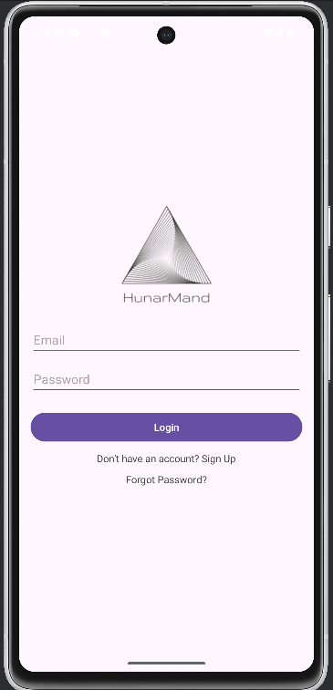
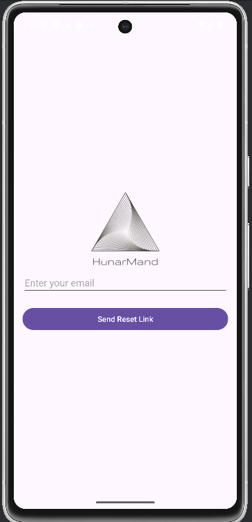
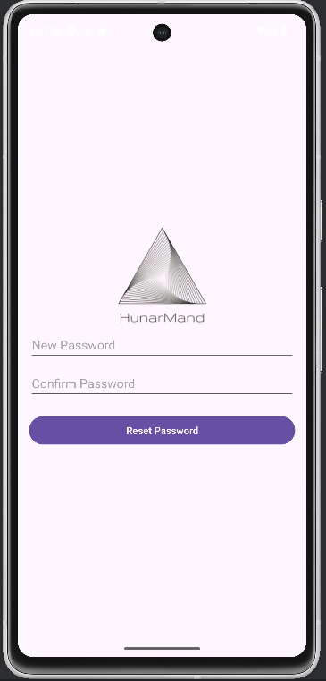
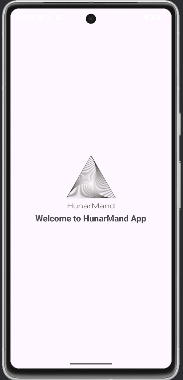

# 📘 HunarMand – Android Authentication App

This project is a **basic Android application** developed using **Java and XML**.  
It demonstrates a **simple authentication system** using **hard-coded credentials**, along with the use of **alternative resources** such as **orientation-specific layouts** and **dual-language (English & Urdu) support**.

This project is developed for **academic / assignment purposes**.

---

## 🚀 Features Implemented

### 1️⃣ Splash Screen
- Displays the application logo
- Automatically navigates to the **Login screen** after a short delay

---

### 2️⃣ Login Screen
- User can login using:
  - Default hard-coded credentials  
  - OR credentials created during signup
- Includes:
  - Email validation
  - Password validation
- On successful login, user is redirected to the **Home (Landing) screen**

#### 🔄 Alternative Resources Used (Login)
- Portrait Layout: `res/layout/activity_login.xml`
- Landscape Layout: `res/layout-land/activity_login.xml`

#### 🌐 Multi-Language Support (Login)
- English: `res/values/strings.xml`
- Urdu: `res/values-ur/strings.xml`
- Language switches automatically based on device settings

---

### 3️⃣ Signup (Register) Screen
- Allows new users to register by entering:
  - Full Name
  - Email
  - Phone Number (11-digit validation)
  - Password & Confirm Password (strong password validation)
- On successful signup:
  - Credentials are stored in a static `AuthManager` class
  - User is redirected to the Login screen

#### 🔄 Alternative Resources Used (Signup)
- Portrait Layout: `res/layout/activity_signup.xml`
- Landscape Layout: `res/layout-land/activity_signup.xml`

#### 🌐 Multi-Language Support (Signup)
- English and Urdu supported using string resources

---

### 4️⃣ Forget Password Screen
- User enters registered email
- Simulates sending a reset link
- Redirects to Reset Password screen

---

### 5️⃣ Reset Password Screen
- User sets a new password
- Password is updated in `AuthManager`
- User can login with the new password

---

### 6️⃣ Home (Landing) Screen
- Displayed after successful login
- Shows a welcome message

---

## 🧠 Authentication Logic

- Uses a static `AuthManager` class as a mock database
- Stores:
  - Email
  - Password
- Used across Signup, Login, and Reset Password screens

> ⚠️ Data is stored in memory only and resets when the app restarts.

---

## 🔄 Application Flow

```Splash Screen
↓
Login Screen
├── Signup Screen → Login Screen
├── Forget Password → Reset Password → Login Screen
└── Home Screen

```

---

## 🛠 Technologies Used

- Java
- XML
- Android SDK
- Android Studio

---

## 🌐 Localization & Orientation Support

| Feature | Status |
|------|------|
| Portrait Layout | ✅ |
| Landscape Layout | ✅ |
| English Language | ✅ |
| Urdu Language | ✅ |
| Auto Language Switching | ✅ |

---

## 📌 Default Credentials

Email: admin@gmail.com
Password: Admin@123


(New users can register using the Signup screen)

---

## Authentication App Screenshots

1. **Signup Screen**  
     
   Displays the signup form with name, email, phone, password fields, and logo.

2. **Login Screen**  
     
   Shows the login form where users can enter email and password.

3. **Forget Password Screens**  
     
   Allows users to apply for retrieve their password.

4. **Reset Password Screens**  
     
   Allows users to reset their password.

5. **Home / Landing Screen**  
     
   Shows a welcome message after successful login.

## ✅ Assignment Notes

- No database or Firebase used
- No external libraries
- Focus on:
  - Activities & Intents
  - Form Validation
  - Alternative Resources
  - Localization
  - Basic Authentication Flow

---

## 👨‍💻 Author

**Ahmad**


